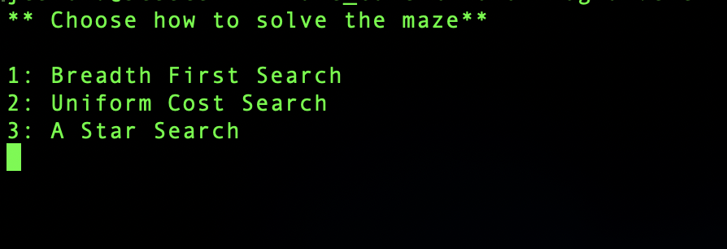
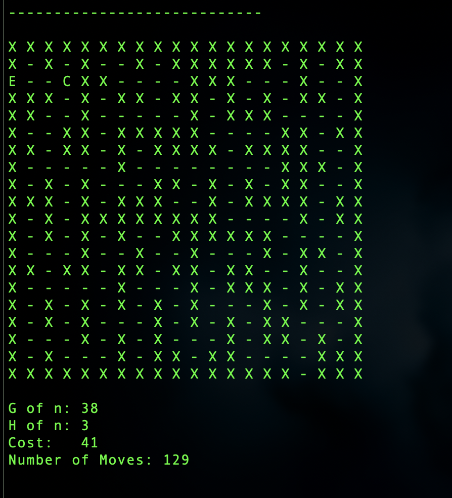
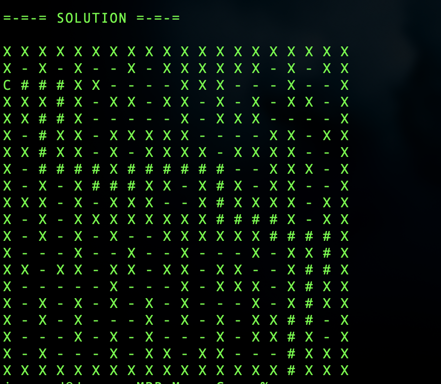

# Maze Solver Console Project

This is a C# console project using visual studio .NET. This projects implements an A.I. to find the shortest path in any given maze.

Searches performed:
- Breadth First Search
- Uniformed Cost Search
- A Star Search with a Manhatten Distance heuristic

The Program first ask to select which search you would like to perform

After a Search is chosen, it will display each step of the search process until a solution is found or until all the moves have been explored.

After a solution is found, the path that led to the solution will be marked with "#"

The main purposes of this project was to explore the different search algorithms that an A.I. can use. The project is coded to a specific 2D array size but is capable of solving any size maze. The program shows the efficiency of the A Star algorithm compared to the Breadth First Search and the Uniform Cost Search.
